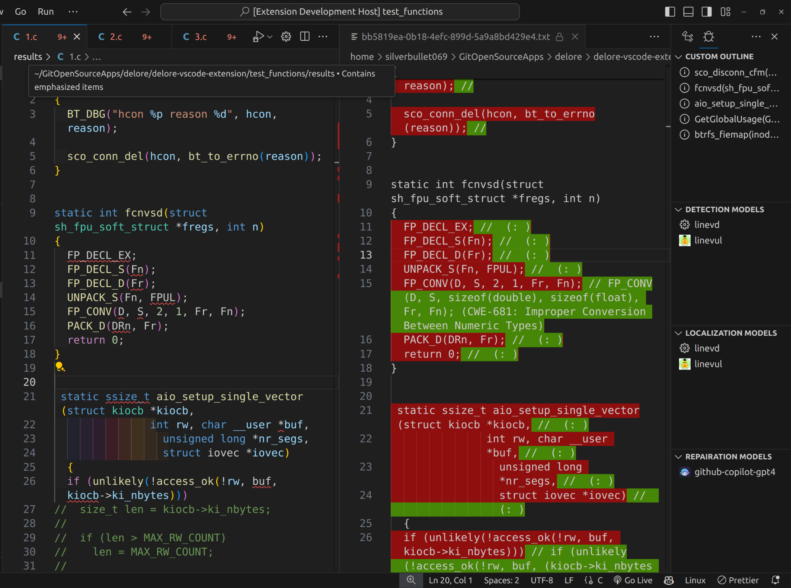

<h1 align="center">
    DeLoRe - Detecting, Locating and Repairing C/C++ Software Vulnerabilities
</h1>



This is a **[Visual Studio Code](https://github.com/Microsoft/vscode)** extension, which can automatically:
1. Detect vulnerabilities at function-level.
2. Locate vulnerabilities specifically at line-level.
3. Repair vulnerabilities by providing suggestions to the user.

## Table of contents
1. [Introduction](#introduction)
2. [Demo](#demo)
3. [Requirements](#requirements)
4. [Development](#development)
5. [What's next?](#whats-next)
6. [What I would do if I start again the project](#what-i-would-do-if-i-start-again-the-project)
7. [Contributors](#contributors)
8. [References](#references)

## Introduction
In the modern digital age, the security of software applications is of paramount importance. Vulnerabilities in software can lead to serious consequences, including data breaches, system downtime, loss of user trust, ... Despite the best efforts of developers, vulnerabilities can still creep into software due to a variety of reasons such as coding errors, lack of understanding of security principles, or the complexity of modern software systems.

This is where a tool like DeLoRe comes into play. DeLoRe is a [Visual Studio Code](https://github.com/Microsoft/vscode) extension that is designed as an **AI wrapper** to automatically **detect, locate, and repair** vulnerabilities in **C/C++ software**. It operates at the function level, pinpointing vulnerabilities at the line level, and provides suggestions for repairing these vulnerabilities.

By integrating DeLoRe into the development process, developers can catch and fix vulnerabilities early, before they become a problem. This not only improves the security of the software but also saves time and resources that would otherwise be spent on dealing with the consequences of a security breach.

[Back to ToC](#table-of-contents)

## Demo

<u>_Commands_</u>: **`Shift`** + **`Alt`** + **`D`**

**CAUTION**: This demo took 2 minutes to run.


[Back to ToC](#table-of-contents)

## Requirements
- [**NodeJS**](https://nodejs.org/en/download/) (>= *v20*)
- [**Python**](https://www.python.org/downloads/) (tested in *v3.10.12*)
- [**Visual Studio Code**](https://code.visualstudio.com/download) (tested in *v1.82.0*)
- [**GitHub Copilot Extension**](https://marketplace.visualstudio.com/items?itemName=GitHub.copilot) (tested in v1.196.0)
- [**unzip**](https://linuxize.com/post/how-to-unzip-files-in-linux) (Linux only)

[Back to ToC](#table-of-contents)

## Development
1. Clone the repository and change directory
```sh
$ git clone --depth 1 git@github.com:Silverbullet069/delore.git && cd ./delore/delore-vscode-extension
```

2. Install NodeJS dependencies
```sh
$ npm install
```

3. Setup Python development environment
```sh
$ python -m venv ./python/virtual_envs/py-delore
$ source ./python/virtual_envs/py-delore/bin/activate[.fish] # if your terminal is Fish shell
$ pip install -r requirements.txt
```

4. Download AI Models from Google Drive

> <u>_NOTE:_</u>: make sure you save enough disk space for this step

You can remove `&& rm <model>.zip` to retain your archive files.

```sh
# Devign
$ gdown https://drive.google.com/uc?id=1uhT71kvoJ87Eb4hCjPdP-Ekww8SaJ35W && unzip devign.zip -d ./python/ai_models && rm devign.zip

# LineVul
$ gdown https://drive.google.com/uc?id=1-A8WUw-4WnaeLRNsv3sUnfUXeJLmm1RG && unzip linevul.zip -d ./python/ai_models && rm linevul.zip

# LineVD
$ gdown https://drive.google.com/uc?id=1HQbCRMSixoKa_Y-nJK_bAvY9MSK2E72O && unzip linevd.zip -d ./python/ai_models && rm linevd.zip
```

5. Sign up for a GitHub Copilot subscription

> <u>_NOTE:_</u>: Normally, you need to buy their subscription to get an API key and integrate Copilot into your workflow. But if you're a student and you possess an education email, you can sign up for their School Subscription: https://education.github.com/ to use GitHub Copilot for free.

[Back to ToC](#table-of-contents)

## What's next?

DeLoRe has covered all basic functionalities and nitty-gritty UI/UX features. However, there are some advanced features that I haven't got the time to do. These are the guides for future contributors:

- **Provide parallelism**: For now, DeLoRe can only run 1 function/1 model at a point in time. Contributors can:
    + Redefine the standardized inputs and outputs, both from DeLoRe's and from model's view.

- **Let User toggle between _Local_ or _Remote_ mode**: For now, DeLoRe is in **_Local_** mode, which means all resources are downloaded and stored in user machine. To develop **_Remote_** mode, contributors can:
    + Create a simple Back-end. My recommendations are Python libraries/frameworks such as Flask, FastAPI, Django, ... etc.
    + Design REST API and enforce the standardized input and output to its Requests and Responses.
    
- Let User add their custom models. DeLoRe is designed so it can **merge the results of multiple models into one.** The more models it has, the better the result is. To develop this feature, contributors can:
    + Redefined the input and output of some unused AI models in the future to achieve compatibility with Standardized Input and Output.

[Back to ToC](#table-of-contents)

## What I would do if I start again the project

### Problem 1: Parallelism is impossible
Some models create temporary files with concreate file name to handle internal process. If I run 2 processes on the same model, the latter process will overwrite the temporary files which is currently being used by the former process, which render the former progress useless, and soon the latter process as well. Consider the current structure, workaround to handle 2 functions at the same time is very hard to make.

```ts
const detectionOutputEithers = await Promise.all(promises); // not viable
```

### How can I solve this? 

By run the model for ALL functions, usually all the models can do that. I need to fix the output flows. Still, it's my ignorance that make the decision to run model for each function.

### Problem 2: Haven't enforced the dependency rules

3-layer architecture has very strict rules, VSCode API should only inside View layer but it's inside Business logic as well. I think it's hard to seperate the logic since business logic is too coupled with VSCode API.

### How can I solve this?
I can't.

### Drawbacks
IntelIJ, Netbeans, Webstorm, ... won't be able to integrate with my Extension soon.

[Back to ToC](#table-of-contents)

## Contributors

Special thanks to my junior [Uyen Pham](https://github.com/21020419PhamTuUyen) for:
- Training, evaluating, refining and redefining inputs and outputs of Devign, LineVul and LineVD model.
- Create evaluation dataset for DeLoRe.
- Co-author of Technology Project subject.

[Back to ToC](#table-of-contents)

## References 
- **Devign**: https://github.com/saikat107/Devign
- **LineVul**: https://github.com/awsm-research/LineVul
- **LineVD**: https://github.com/davidhin/linevd

[Back to ToC](#table-of-contents)